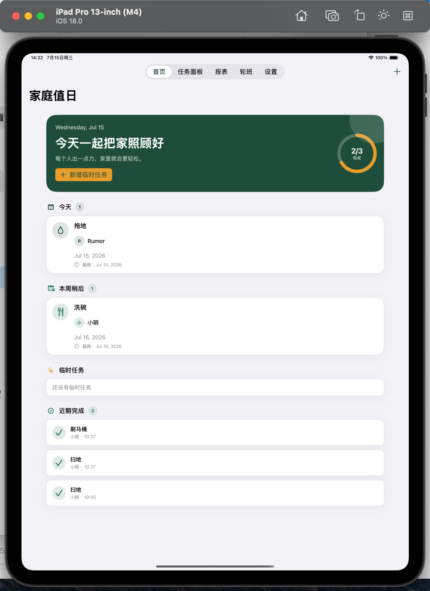
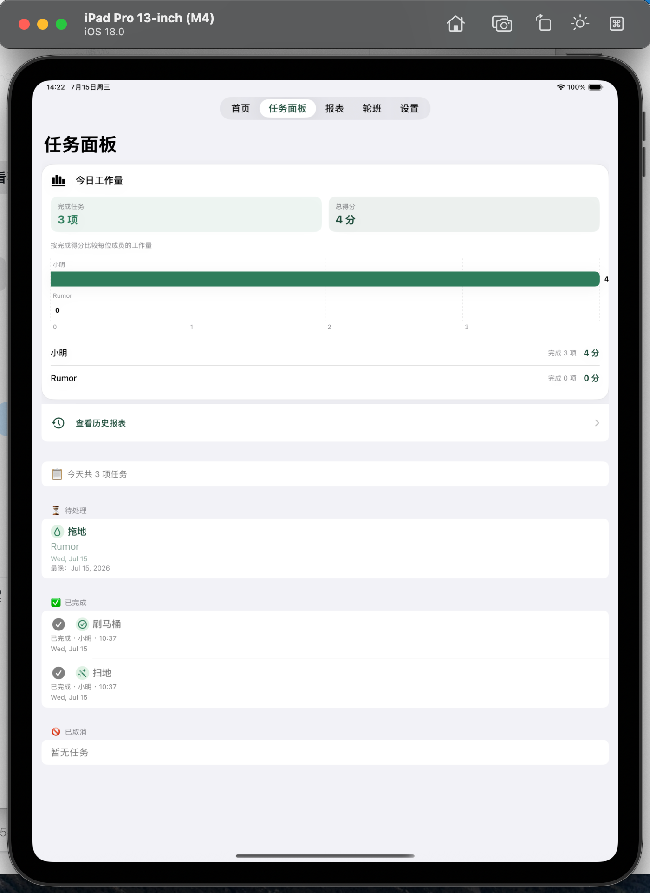

# 家庭值日

家庭值日是一款面向单个家庭、运行在一台 iPad 上的离线值日管理应用。它用固定轮班规则生成任务，用任务实例记录本次实际发生的调整，并把完成结果保存在设备本地。

## 功能概览

- 首次启动引导：一次添加多个家庭成员，并创建第一项固定值日。
- 首页：按“已逾期”“今天”“本周稍后”“临时任务”查看待办，并显示近期完成记录；任务卡支持带确认步骤的快速完成。
- 任务面板：集中查看当天的待处理、已完成和已取消任务，并显示当天成员的完成数量与得分；任务卡支持快速完成。
- 成员识别：成员可设置颜色，列表、任务卡和完成人选择中显示颜色头像与首字母。
- 固定轮班：按星期、起始轮班周和成员顺序自动轮换负责人；规则可以启用或停用。
- 单次调整：对某一项固定任务单独改派、改期、设置截止日期或取消，不影响后续周次的轮换顺序。
- 临时任务：创建指定负责人或“待领取”的任务；支持常用家务预设、得分和截止日期。
- 完成记录：记录实际完成者、完成时间、计划工作日和任务得分。
- 报表：按日、周、月查看成员完成数量和得分；查看本周每位成员已分配的任务数和计划分值；并在周报、月报中查看每日工作量趋势。
- 历史中心：查看全部完成记录，按日期、完成人和任务名称筛选，并查看任务详情或重新创建类似临时任务。
- 本地通知：可配置每日任务汇总和逾期任务提醒。
- 数据管理：在设置页集中备份和恢复成员、轮班规则、任务与完成记录。
- iPad 适配：使用 SwiftUI 和统一设计系统，支持横屏、竖屏、深色模式和辅助功能标识。

## 界面展示

### 首页



### 任务面板



## 技术栈与运行环境

- SwiftUI
- SwiftData
- UserNotifications
- Swift Charts
- XCTest / XCUITest
- macOS 与 Xcode 16 或以上版本
- XcodeGen
- iPadOS 17 或以上版本

工程的 iOS 部署目标为 17.0，目标设备为 iPad。工程配置由 `project.yml` 管理，修改 Target、文件来源或 Scheme 后需要重新生成 Xcode 工程。

## 项目结构

```text
FamilyDuty/
├── Models/       SwiftData 持久化模型和任务状态
├── Services/     轮班、任务生成、完成、截止日期、通知和数据容器服务
├── Features/     首页、任务面板、轮班、报表、设置和首次引导
├── DesignSystem/ 颜色、间距、卡片和通用 SwiftUI 组件
└── AppRootView.swift / FamilyDutyApp.swift
FamilyDutyTests/   模型、服务和 ViewModel 单元测试
FamilyDutyUITests/ 首次引导、主要流程和无障碍 UI 测试
docs/plans/        功能实现和设计计划
project.yml        XcodeGen 工程配置
```

## 生成并打开工程

```bash
cd /Users/rumor/Desktop/mine/family_duty
xcodegen generate
open FamilyDuty.xcodeproj
```

在 Xcode 中选择 `FamilyDuty` Scheme 和任意 iPad 模拟器后按 `Command + R`。首次进入时按引导创建一名或多名成员和一项固定值日。

如果设备列表中没有可用的 iPad 模拟器，可在 Xcode 的 `Settings > Platforms` 下载 iOS Simulator Runtime，再通过 `Window > Devices and Simulators` 创建或安装 iPad 模拟器。

## 命令行构建与测试

构建 App：

```bash
xcodebuild build \
  -project FamilyDuty.xcodeproj \
  -target FamilyDuty \
  -sdk iphonesimulator \
  CODE_SIGNING_ALLOWED=NO
```

运行完整单元测试和 UI 测试：

```bash
xcodebuild test \
  -project FamilyDuty.xcodeproj \
  -scheme FamilyDutyTests \
  -destination 'platform=iOS Simulator,name=iPad Pro 13-inch (M4)' \
  -derivedDataPath /private/tmp/FamilyDutyDerivedData
```

`FamilyDutyTests` Scheme 同时包含 `FamilyDutyTests` 和 `FamilyDutyUITests`。如果本机没有示例设备，先查看可用模拟器并替换 destination：

```bash
xcrun simctl list devices available
```

UI 测试使用 `-uiTesting` 启动参数建立内存 SwiftData 容器，测试种子数据通过额外参数注入，例如 `-seedDashboardTask`、`-seedOverdueTask` 和 `-seedTaskBoard`，不会读取或修改正式应用数据。

## 核心业务规则

### 固定轮班与任务实例

`ChoreRule` 保存任务标题、星期、起始轮班周、成员参与顺序和得分。`RotationScheduler` 根据周次和成员顺序计算负责人，`TaskGenerationService` 按需生成对应的 `ChoreTask`。

固定规则和实际任务是两层数据：改派、改期、取消和截止日期只作用于当前任务实例，不修改规则，也不会改变之后周次的负责人顺序。成员顺序通过独立的 UUID 数组持久化，不能依赖 SwiftData 关系数组的当前排列。

### 临时任务、完成与截止日期

临时任务不关联固定规则，因此不会进入轮班计算。无负责人任务可以由家庭成员领取后再完成。完成任务时会创建 `CompletionRecord`，并保存完成者名称快照，以便成员被删除后历史报表仍能显示名称。

任务未显式设置截止日期时，截止日期按计划日计算；截止日期不能早于计划日。只有仍处于待处理状态且当前日期已经超过有效截止日的任务才算逾期，已完成或已取消任务不会进入逾期列表。

### 报表与本地通知

报表按完成记录统计成员的完成数量和得分，并按任务保留最新的完成记录，避免重复记录重复计分。报表同时按当前自然周内已分配的固定任务和临时任务统计每位成员的计划任务数与计划分值；待领取任务不归属任何成员，已完成和已取消任务仍属于计划负担。日报不显示趋势图，周报和月报显示按计划工作日聚合的每日趋势。

通知只在本机调度：启用后可以在设置中配置每日汇总时间和逾期提醒时间。关闭权限或拒绝权限不会影响任务管理；需要时可从通知设置跳转到 iPad 系统设置。

## 在实体 iPad 上测试

准备条件：iPad 运行 iPadOS 17 或以上，并通过 USB 连接 Mac，或已在 Xcode 中启用无线调试。

1. 在 iPad 上打开 `设置 > 隐私与安全性 > 开发者模式`，按系统提示启用并重启。
2. 在 Xcode 的 `Settings > Accounts` 登录 Apple ID。
3. 选择 `FamilyDuty` Target，在 `Signing & Capabilities` 中启用自动签名并选择自己的 Team。
4. 如果 `com.familyduty.app` 已被占用，把 Bundle Identifier 改为唯一值，并同步修改 `project.yml` 中的 `PRODUCT_BUNDLE_IDENTIFIER`，然后重新运行 `xcodegen generate`。
5. 选择已连接的 iPad，按 `Command + R` 安装并启动应用；首次连接时按提示信任电脑。
6. 如果出现开发者不受信任提示，进入 `设置 > 通用 > VPN 与设备管理` 信任对应证书。

建议至少验证以下场景：

- 完成首次引导，创建两名以上成员和一项固定值日。
- 在横屏、竖屏、浅色和深色模式下检查首页、任务面板、轮班、报表和设置。
- 完成、领取、撤销、改派、改期、设置截止日期和取消任务，确认后续轮换不受单次调整影响。
- 创建指定负责人和待领取的临时任务，确认临时任务不会改变固定轮班。
- 启用通知并授权，检查每日汇总、逾期提醒和系统设置跳转。
- 结束应用后重新打开，确认成员、任务和完成记录仍然存在。

## 后续 TODO

### 计划工作量与实际完成量

- [ ] 同时展示已完成、待完成和逾期数量。
- [ ] 对比计划负担与实际完成情况，帮助家庭发现分配不均，不引入成员排名。
- [ ] 提供未来几周的轮班预览。

### 成员归档与请假

- [ ] 支持将成员设为暂时停用或已离开家庭，而不是只能删除或保留。
- [ ] 停用成员自动退出未来轮班，同时保留历史完成记录和姓名快照。
- [ ] 支持一周或多周请假。
- [ ] 支持临时跳过或交换某次轮班。

### 更灵活的重复规则

- [ ] 支持每天、每两周、每月某天和每月第几个星期几。
- [ ] 支持自定义重复间隔。
- [ ] 支持一次性暂停规则。

### 自定义任务预设

- [ ] 支持家庭自定义任务预设。
- [ ] 为预设保存默认负责人、默认得分和默认截止日期。
- [ ] 支持简单步骤清单，例如“洗碗：冲洗、放入洗碗机、擦干台面”。

### 技术债整理

- [ ] 统一 `project.yml` 中的 `SWIFT_VERSION` 与项目文档中的 Swift 版本方向，并单独完成技术债整理。

## 数据范围与限制

当前版本不包含登录、服务器、多人同步或云端备份。成员、轮班规则、任务和完成记录仅保存在运行应用的本机 iPad 上。删除应用或抹掉设备可能导致数据永久丢失。

应用不会提交家庭成员信息或任务数据到网络；测试和开发时也不要把真实家庭数据、凭据、签名文件或用户专属 Xcode 设置提交到仓库。
