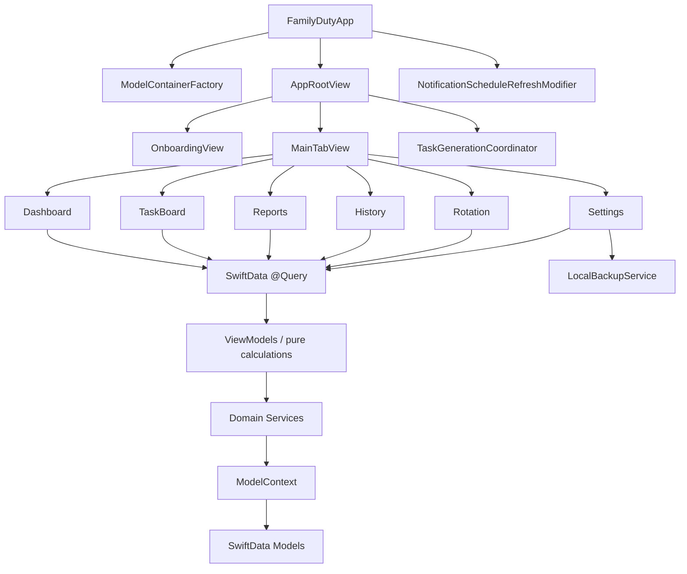
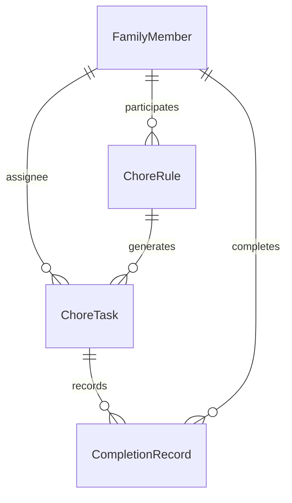
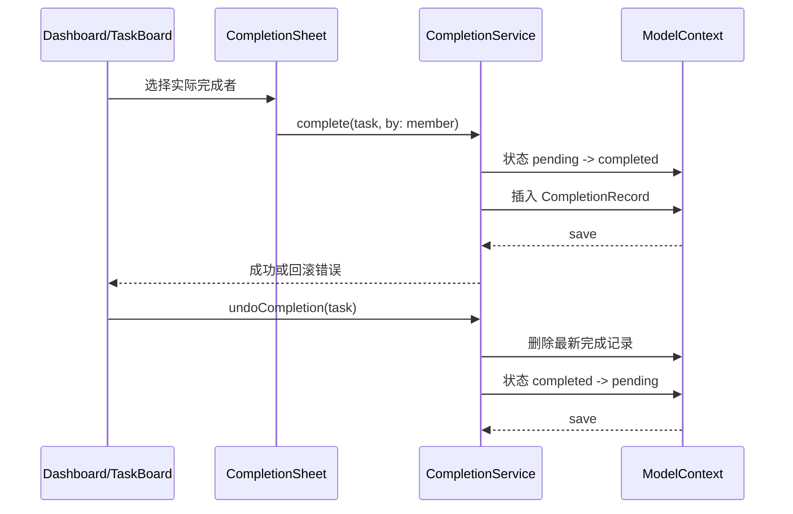

# FamilyDuty 项目架构

> 本文是 FamilyDuty 的代码架构总览。内容以当前 `FamilyDuty/` 源码、`project.yml` 和测试目录为准，并吸收 `docs/plans/` 中已经落地的设计决策。计划文档描述的是实现过程；如果计划与源码不一致，以源码和测试行为为准。

功能模块的细分说明见 [`docs/functional-architecture.md`](functional-architecture.md)。

截至 2026-07-15，FamilyDuty 是一款面向单个家庭、运行在一台 iPad 上的离线 SwiftUI 应用。数据保存在本机 SwiftData 容器中，不包含登录、云同步、服务器 API 或远程分析。

## 1. 架构总览

FamilyDuty 采用“SwiftUI 页面 + 可测试 ViewModel/Service + SwiftData 本地模型”的分层结构：

### 1.1 依赖方向

- `Models` 只描述持久化数据和值类型，不依赖具体页面。
- `Services` 封装轮班、任务生成、完成、截止日期、通知、备份和成员删除等业务规则或副作用。
- `Features` 负责查询、展示和用户交互；复杂规则通过 ViewModel 或 Service 完成，不在 View 中复制。
- `DesignSystem` 只提供展示层 token 和 SwiftUI 组件，不访问 SwiftData。
- `AppRootView`/`FamilyDutyApp` 负责应用生命周期、容器注入、首次启动分支、测试种子和全局刷新入口。

## 2. 工程与运行时边界

### 2.1 工程配置

`project.yml` 是 XcodeGen 的唯一工程配置来源：

- 应用 Target：`FamilyDuty`。
- 单元测试 Target：`FamilyDutyTests`。
- UI 测试 Target：`FamilyDutyUITests`。
- 部署目标：iOS/iPadOS 17.0。
- `TARGETED_DEVICE_FAMILY` 为 iPad（值为 `2`）。
- 新增 `FamilyDuty/`、`FamilyDutyTests/` 或 `FamilyDutyUITests/` 下的 Swift 文件后，应运行 `xcodegen generate` 更新生成的 Xcode 工程。

### 2.2 应用入口与全局状态

| 文件 | 职责 |
| --- | --- |
| `FamilyDuty/FamilyDutyApp.swift` | 创建 SwiftData 容器；UI 测试时切换到内存容器；把容器注入根视图；挂载通知刷新 modifier。 |
| `FamilyDuty/AppRootView.swift` | 根据成员是否存在决定显示首次引导或主界面；启动和回到前台时补齐未来固定任务；提供 UI 测试种子；定义六个主 Tab。 |
| `FamilyDuty/Services/ModelContainerFactory.swift` | 集中注册四个 SwiftData 模型，并提供正式持久化容器和内存测试容器。 |
| `FamilyDuty/Services/TaskGenerationCoordinator.swift` | App 根层的幂等刷新入口，默认维护当前日期起未来 8 周的固定任务。 |
| `FamilyDuty/Services/NotificationScheduleRefreshModifier.swift` | 监听任务和通知设置签名，在任务或设置变化后刷新托管通知。 |

正式运行使用设备本地 SwiftData；带有 `-uiTesting` 参数时使用内存容器，并由 `AppRootView` 根据 `-seed...` 参数写入确定性夹具。

## 3. 数据层：SwiftData 领域模型

### 3.1 模型关系

### 3.2 模型职责与字段语义

| 文件 | 类型 | 关键字段/规则 |
| --- | --- | --- |
| `FamilyDuty/Models/FamilyMember.swift` | `FamilyMember` | `id`、`name`、`colorName`、`sortOrder`；成员排序用于页面展示和统计排序。 |
| `FamilyDuty/Models/ChoreRule.swift` | `ChoreRule` | 固定任务标题、星期、起始轮班周、启用状态、默认 `score`、`participants` 和独立持久化的 `participantOrder`。 |
| `FamilyDuty/Models/ChoreTask.swift` | `ChoreTask` | 一次具体任务实例；保存计划日期、可选 `deadline`、实例 `score`、负责人、来源规则、临时任务标记、状态和调整说明。 |
| `FamilyDuty/Models/CompletionRecord.swift` | `CompletionRecord` | 保存完成时间、计划工作日 `workDate`、完成时得分、完成者关系和 `completedByName` 历史快照。 |
| `FamilyDuty/Models/TaskStatus.swift` | `TaskStatus` | `pending`、`completed`、`cancelled` 三种任务状态。 |

### 3.3 核心不变量

- `ChoreRule` 是重复规则；`ChoreTask` 是具体发生的一次任务。临时任务必须没有 `rule`，也不能参与轮班计算。
- 负责人顺序以 `ChoreRule.participantOrder` 的 UUID 数组为准，不能依赖 SwiftData 关系数组的 incidental order。
- 改派、改期、取消、单次 Deadline 或单次得分调整只修改任务实例，不改变规则和后续周次。
- `deadline == nil` 时，有效截止日是 `scheduledDate` 当天；Deadline 不能早于计划日期。
- 只有 `pending` 任务可以逾期；完成或取消后不再显示逾期。
- 完成任务时必须同时更新任务状态并创建完成记录；保存失败应恢复任务状态并清理未保存的记录。
- 完成记录保留完成者姓名快照，成员被删除后历史仍可读。
- 报表按任务取最新完成记录，避免撤销/重复记录导致重复计分。

## 4. 服务层：业务规则与副作用

### 4.1 轮班、任务生成和日期规则

| 文件 | 主要职责 | 主要调用方 |
| --- | --- | --- |
| `FamilyDuty/Services/CalendarProvider.swift` | 提供可注入的 `Calendar`，隔离设备日期、时区和周边界差异。 | 日期相关测试、服务和 ViewModel。 |
| `FamilyDuty/Services/RotationScheduler.swift` | 根据规则起始周、目标周和 `participantOrder` 计算负责人。 | `TaskGenerationService`。 |
| `FamilyDuty/Services/TaskGenerationService.swift` | 按规则和日期窗口生成固定任务；按规则 ID + 计划日期去重；保留已有实例。 | `TaskGenerationCoordinator`、`RotationViewModel`、引导流程。 |
| `FamilyDuty/Services/TaskGenerationCoordinator.swift` | 在启动/回前台时统一补齐未来任务，保证重复调用幂等。 | `AppRootView`。 |
| `FamilyDuty/Services/TaskDeadlineService.swift` | 统一有效截止日、日期归一化、逾期判定和 Deadline 校验。 | Dashboard、TaskBoard、临时任务和单次调整。 |
| `FamilyDuty/Services/ScoreValidationService.swift` | 保证得分为大于等于 1 的整数。 | 规则、临时任务和单次调整 ViewModel。 |

### 4.2 完成、成员保护和数据管理

| 文件 | 主要职责 |
| --- | --- |
| `FamilyDuty/Services/CompletionService.swift` | 在 `@MainActor` 上完成任务、撤销完成和失败回滚；完成时生成 `CompletionRecord`。 |
| `FamilyDuty/Services/MemberDeletionService.swift` | 删除成员前检查固定规则、待办任务和历史记录引用，并返回可展示的阻止原因。 |
| `FamilyDuty/Services/LocalBackupService.swift` | 使用带 `schemaVersion` 的 Codable DTO 导出/恢复成员、规则、任务和完成记录；校验重复 ID、关系引用和非法值，恢复失败时回滚。 |
| `FamilyDuty/Services/FamilyDutyBackupDocument.swift` | 将 JSON 备份数据适配为 SwiftUI `FileDocument`，供系统文件导入/导出流程使用。 |

### 4.3 通知

| 文件 | 主要职责 |
| --- | --- |
| `FamilyDuty/Services/NotificationAuthorizationService.swift` | 封装通知权限查询、请求和被拒绝时的展示文案。通过 `NotificationCenterClient` 支持测试替身。 |
| `FamilyDuty/Services/NotificationScheduler.swift` | 只管理每日汇总和逾期汇总两个托管请求；刷新前先清理旧请求；通知被关闭或无任务时不创建请求。 |
| `FamilyDuty/Services/NotificationScheduleRefreshModifier.swift` | 监听任务、状态、日期、Deadline、负责人和通知设置变化，驱动调度刷新。 |

通知是本地副作用，权限被拒绝不会阻断任务管理；无关的系统通知请求不会被删除。

## 5. 功能层：页面、ViewModel 与共享交互

页面层统一使用 SwiftUI、`@Query` 和 `ModelContext`。ViewModel 分为两类：

- 纯计算 ViewModel：接收数组、日期和 Calendar，返回分组、统计或展示数据，便于 XCTest 确定性验证。
- `@MainActor` 变更 ViewModel：执行校验、更新模型、保存和失败回滚。

### 5.1 首页 Dashboard

| 文件 | 职责 |
| --- | --- |
| `FamilyDuty/Features/Dashboard/DashboardView.swift` | 展示逾期、今天、本周稍后、临时任务和近期完成记录；发起完成、领取、调整和新增临时任务交互。 |
| `FamilyDuty/Features/Dashboard/DashboardViewModel.swift` | 按任务状态、日期和 Deadline 分组；提供逾期排序和无障碍标签。 |

逾期任务进入首页独立的“已逾期”分组，并从临时任务分组中排除，避免同一实例重复展示。

### 5.2 任务面板

| 文件 | 职责 |
| --- | --- |
| `FamilyDuty/Features/TaskBoard/TaskBoardView.swift` | 展示当天待处理、已完成、已取消任务；支持完成、领取、调整和撤销完成。 |
| `FamilyDuty/Features/TaskBoard/TaskBoardViewModel.swift` | 只筛选 `scheduledDate` 属于当天的任务，按状态分组，并关联最新完成记录和当天工作量。 |

任务面板是 Dashboard 之外的当天全量视图，其他日期任务不会混入。

### 5.3 报表与计划工作量

| 文件 | 职责 |
| --- | --- |
| `FamilyDuty/Features/Reports/ReportsView.swift` | 提供日报、周报、月报切换和历史日期浏览入口。 |
| `FamilyDuty/Features/Reports/ReportsViewModel.swift` | 管理报表类型、锚点日期、周期前后移动和周期标题。 |
| `FamilyDuty/Features/Reports/ReportPeriod.swift` | 定义日/周/月周期、日期区间和周期移动。 |
| `FamilyDuty/Features/Reports/ScoreReportViewModel.swift` | 对完成记录按任务去重，计算成员完成数量、得分和按工作日的趋势点。 |
| `FamilyDuty/Features/Reports/WorkloadSummaryView.swift` | 展示成员完成数量和得分摘要。 |
| `FamilyDuty/Features/Reports/WorkloadChartView.swift` | 使用 Swift Charts 展示工作量趋势。 |
| `FamilyDuty/Features/Reports/PlannedWorkloadViewModel.swift` | 从当前周期任务实例计算已分配任务数和计划分值，不新增持久化字段。 |
| `FamilyDuty/Features/Reports/PlannedWorkloadSummaryView.swift` | 展示计划工作量摘要。 |

报表的“实际完成量”来自 `CompletionRecord`；“计划工作量”来自 `ChoreTask`。两者保持独立，避免把未完成任务误算为已完成。

### 5.4 历史中心

| 文件 | 职责 |
| --- | --- |
| `FamilyDuty/Features/History/HistoryView.swift` | 展示全部完成记录、日期/成员/任务筛选和搜索入口。 |
| `FamilyDuty/Features/History/HistoryViewModel.swift` | 以内存方式筛选记录，按任务使用最新记录，兼容已删除成员的姓名快照。 |
| `FamilyDuty/Features/History/HistoryDetailView.swift` | 展示单条历史记录的任务、完成者、工作日、精确完成时间和得分。 |
| `FamilyDuty/Features/Tasks/TemporaryTaskDraft.swift` | 从历史记录生成新的临时任务草稿，只复制标题和得分。 |

从历史中心重新创建任务时，不复制旧日期、负责人、Deadline 或固定规则。

### 5.5 固定轮班

| 文件 | 职责 |
| --- | --- |
| `FamilyDuty/Features/Rotation/RotationListView.swift` | 查询和展示固定规则、下一位负责人、启用状态，并打开新增/编辑流程。 |
| `FamilyDuty/Features/Rotation/RuleEditorView.swift` | 编辑标题、星期、起始轮班周、成员、启用状态和默认得分。 |
| `FamilyDuty/Features/Rotation/MemberOrderEditorView.swift` | 编辑成员参与顺序，最终写入 `participantOrder`。 |
| `FamilyDuty/Features/Rotation/RotationViewModel.swift` | 校验并保存规则、生成未来任务、执行单次任务调整和失败恢复。 |
| `FamilyDuty/Features/Tasks/TaskAdjustmentSheet.swift` | 编辑某一个任务实例的负责人、日期、Deadline、得分或取消原因。 |

编辑规则时会清理未开始且没有调整说明的待处理任务，再按新规则生成；已有完成任务和带调整的任务不被覆盖。

### 5.6 临时任务与共享任务操作

| 文件 | 职责 |
| --- | --- |
| `FamilyDuty/Features/Tasks/TemporaryTaskEditorView.swift` | 创建临时任务，支持预设、日期、Deadline、得分、指定负责人或待领取。 |
| `FamilyDuty/Features/Tasks/TemporaryTaskViewModel.swift` | 校验标题、得分和 Deadline；创建任务或处理待领取任务。 |
| `FamilyDuty/Features/Tasks/ClaimTaskSheet.swift` | 为待领取任务选择成员并调用领取逻辑。 |
| `FamilyDuty/Features/Tasks/CompletionSheet.swift` | 选择实际完成者并调用完成服务。 |
| `FamilyDuty/Features/Tasks/QuickCompletionConfirmation.swift` | 为任务卡提供快速完成确认 modifier。 |
| `FamilyDuty/Features/Tasks/TaskPreset.swift` | 定义无持久化副作用的预设数据，包括标题、emoji 和 SF Symbol。 |
| `FamilyDuty/Features/Tasks/TaskPresetCatalog.swift` | 提供标准家务预设、标题归一化、emoji/SF Symbol 映射和自定义任务 fallback。 |
| `FamilyDuty/Features/Tasks/TaskTitleView.swift` | 在展示层使用统一任务图标和标题；不污染持久化标题，也隐藏装饰图标的 VoiceOver 朗读。 |

预设只回填 `ChoreTask.title`，不会改变日期、得分、Deadline 或负责人。未知自定义任务使用通用展示图标。

### 5.7 首次引导与设置

| 文件 | 职责 |
| --- | --- |
| `FamilyDuty/Features/Setup/OnboardingView.swift` | 空数据库首次启动流程，创建成员和第一条固定规则。 |
| `FamilyDuty/Features/Setup/OnboardingViewModel.swift` | 校验成员姓名，原子创建成员和首条规则。 |
| `FamilyDuty/Features/Settings/SettingsView.swift` | 管理成员、通知设置和数据管理入口。 |
| `FamilyDuty/Features/Settings/MemberEditorView.swift` | 新增/编辑成员姓名和颜色。 |
| `FamilyDuty/Features/Settings/NotificationSettingsView.swift` | 管理通知开关、每日汇总时间、逾期提醒时间和系统权限入口。 |
| `FamilyDuty/Features/Settings/DataManagementView.swift` | 导出和恢复本地 JSON 备份，并展示成功/失败状态。 |

成员删除必须经过 `MemberDeletionService`，页面不能直接删除成员。

## 6. 关键业务数据流

### 6.1 启动与固定任务补齐

1. `FamilyDutyApp` 创建 SwiftData 容器并注入 `AppRootView`。
2. `AppRootView` 查询成员；无成员时显示 `OnboardingView`，否则显示 `MainTabView`。
3. 启动或回到前台时调用 `TaskGenerationCoordinator.refresh()`。
4. 协调器读取规则，调用 `TaskGenerationService`，由 `RotationScheduler` 计算负责人。
5. 服务按“规则 ID + 计划日期”去重，创建缺少的固定任务并一次保存。

### 6.2 完成与撤销

完成记录保存实际完成者、完成时间、计划工作日和得分快照。撤销只删除该任务的最新完成记录，不引入新的状态类型。

### 6.3 单次调整与临时任务

- 固定任务单次调整由 `RotationViewModel.adjust` 完成，只写入当前 `ChoreTask`。
- 临时任务由 `TemporaryTaskViewModel.createTask` 创建，`rule == nil` 且 `isTemporary == true`。
- 待领取任务先保持 `assignee == nil`，由 `claim` 操作原子写入负责人。
- 以上流程都在保存失败时恢复任务的上一状态，避免部分更新。

### 6.4 报表和历史

1. 页面通过 `@Query` 读取 `CompletionRecord`、`ChoreTask` 和 `FamilyMember`。
2. `ScoreReportViewModel.latestRecords` 按任务选择最新记录。
3. `ReportPeriod` 根据注入的 Calendar 计算日、周、月区间。
4. `ScoreReportViewModel` 计算实际完成量；`PlannedWorkloadViewModel` 从任务实例计算计划负担。
5. `HistoryViewModel` 复用最新记录语义，筛选结果可进入详情或生成新的 `TemporaryTaskDraft`。

### 6.5 通知刷新

任务状态、计划日期、Deadline、负责人或通知设置改变后，`NotificationScheduleRefreshModifier` 的签名变化触发刷新：

1. 读取系统待处理通知。
2. 只删除 FamilyDuty 自己的两个 identifier。
3. 按当前日期生成每日任务汇总。
4. 按 `TaskDeadlineService` 生成未完成逾期任务汇总。
5. 权限拒绝或刷新失败只显示错误/恢复入口，不影响本地任务数据。

## 7. 设计系统与可访问性

| 文件 | 职责 |
| --- | --- |
| `FamilyDuty/DesignSystem/FamilyDutyTheme.swift` | 语义颜色、背景、间距、圆角、最小点击高度和卡片 modifier。 |
| `FamilyDuty/DesignSystem/FamilyDutyComponents.swift` | `FamilyDutyIconBadge`、`FamilyDutySectionHeader`、`FamilyDutyStatusPill`、`FamilyDutyProgressRing`、`FamilyDutyMemberChip`、`FamilyDutyEmptyState`、`FamilyDutyTaskCard`。 |
| `FamilyDuty/DesignSystem/FamilyDutyMemberColor.swift` | 成员颜色选项、颜色查找和按排序位置分配默认颜色。 |

设计系统的约束：

- 状态必须同时有文字或 SF Symbol，不能只靠颜色或 emoji 表达。
- 任务展示 emoji/SF Symbol 是装饰层，VoiceOver 继续读取纯文本任务标题和业务状态。
- 交互控件保持至少 44pt 触控高度，支持 Dynamic Type、横竖屏和深色模式。
- 页面不再散落业务颜色和卡片样式；新 UI 优先复用 DesignSystem 组件。

## 8. 测试架构

### 8.1 单元测试

`FamilyDutyTests/` 按应用层级镜像实现：

- 基础与模型：`FamilyDutyTests/FamilyDutyTests.swift`、`FamilyDutyTests/Models/ModelPersistenceTests.swift`。
- 服务：`CompletionServiceTests.swift`、`LocalBackupServiceTests.swift`、`MemberDeletionServiceTests.swift`、`NotificationSchedulerTests.swift`、`RotationSchedulerTests.swift`、`TaskDeadlineServiceTests.swift`、`TaskGenerationCoordinatorTests.swift`、`TaskGenerationServiceTests.swift`。
- Features/ViewModel：Dashboard、History、Onboarding、PlannedWorkload、Reports、Rotation、ScoreReport、TaskBoard、TaskPresetCatalog、TemporaryTask。
- 设计与无障碍：`FamilyDutyTests/DesignSystem/FamilyDutyMemberColorTests.swift`、`FamilyDutyTests/AccessibilityTests.swift`。

重点测试策略是注入 `Calendar`、当前时间、`ModelContext` 和通知客户端，覆盖日期边界、轮班稳定性、保存回滚、关系完整性、历史快照和通知重排。

### 8.2 UI 测试

`FamilyDutyUITests/` 覆盖：

- 启动、导航、首次引导：`AppLaunchUITests.swift`、`OnboardingUITests.swift`。
- 首页与任务操作：`DashboardFlowUITests.swift`、`TaskBoardFlowUITests.swift`、`TemporaryTaskPresetFlowUITests.swift`。
- 历史与报表：`HistoryFlowUITests.swift`、`ReportsFlowUITests.swift`。
- 无障碍与视觉流程：`AccessibilityUITests.swift`、`FamilyDutyVisualFlowUITests.swift`。

UI 测试使用内存容器和 `-seedDashboardTask`、`-seedOverdueTask`、`-seedTaskBoard`、`-seedHistory` 等启动参数，避免依赖本机正式数据。修改页面时必须保留既有 accessibility identifier 和关键中文文案。

## 9. 计划文件与当前代码的对应关系

| 计划文件 | 当前对应模块 | 架构结论 |
| --- | --- | --- |
| `2026-07-14-family-duty-ipad-app.md` | App 入口、Models、Services、Dashboard、Rotation、Tasks、Setup、Settings | 基础产品骨架和离线领域模型已形成。 |
| `2026-07-15-deadline-feature.md` | `ChoreTask.deadline`、`TaskDeadlineService`、Dashboard、TaskAdjustment、TemporaryTask | Deadline 属于任务实例；统一由服务判定和校验。 |
| `2026-07-15-p0-reliability-and-backup.md` | `TaskGenerationCoordinator`、`CompletionService`、`LocalBackupService`、DataManagement、通知刷新 | 可靠性修复放在根生命周期和可测试服务中，不扩展到云端。 |
| `2026-07-15-scoring-workload-reports.md` | 规则/任务/完成记录的 `score`、Reports、TaskBoard | 得分沿“规则默认值 → 任务实例 → 完成记录快照”传递。 |
| `2026-07-15-planned-workload.md` | `PlannedWorkloadViewModel`、`PlannedWorkloadSummaryView` | 计划负担是查询时计算值，不新增 SwiftData 字段。 |
| `2026-07-15-task-board-design.md` | `TaskBoardView`、`TaskBoardViewModel`、共享完成流程 | 任务面板复用现有任务模型、完成服务和调整流程。 |
| `2026-07-15-history-center.md` | History 三件套、`TemporaryTaskDraft` | 历史中心复用完成记录，不新增历史模型。 |
| `2026-07-15-task-presets-and-emoji.md` | `TaskPreset*`、`TaskTitleView`、Dashboard/TaskBoard/Rotation 展示层 | 预设和图标是展示/编辑辅助，不污染持久化标题。 |
| `2026-07-15-family-duty-ui-redesign-plan.md` | `DesignSystem` 及各 Feature 页面 | 视觉层集中在 DesignSystem，业务模型和服务保持独立。 |
| `2026-07-15-coresimulator-connection-recovery.md` | Xcode/CoreSimulator 开发环境 | 这是宿主机工具链恢复计划，不属于 App 运行时架构，也不应修改 Swift 业务代码。 |

## 10. 新功能的落点规则

新增需求时按以下顺序定位：

1. 持久化字段、关系或状态变化：先修改 `Models`，同步考虑备份 DTO、迁移兼容和模型测试。
2. 可复用业务规则：放入 `Services`，注入 Calendar、当前时间、Context 或外部客户端，避免写进 View。
3. 页面状态和纯计算：放入对应 `Features/<Feature>/...ViewModel.swift`，优先使用纯函数。
4. 交互表单和页面：放入对应 Feature；只负责输入、展示、调用 ViewModel/Service 和错误呈现。
5. 跨页面视觉：放入 `DesignSystem`；不要复制颜色、间距、卡片和状态胶囊。
6. 导航、启动刷新、全局通知和 UI 测试夹具：只在 `AppRootView.swift` 或 `FamilyDutyApp.swift` 增加入口，避免在每个页面各自实现。
7. 新增 Swift 文件后更新 XcodeGen 生成工程，并补齐单元测试；影响用户流程时再补 UI 测试。

## 11. 当前边界与维护要求

- 保持单设备离线范围；登录、云同步、远程备份、服务器 API 和远程分析需要单独的产品与架构决策。
- 规则和任务实例必须继续分离；不要为了方便把单次调整写回规则。
- 任何日期逻辑都使用注入的 Calendar，不能直接依赖设备当前时区或真实时间。
- 任何涉及成员删除、完成撤销、备份恢复或批量数据替换的操作，都必须保留校验、原子保存和失败恢复路径。
- 修改用户可见 UI 时保留稳定的 accessibility identifier，并在浅色/深色、横竖屏、Dynamic Type 和 VoiceOver 场景下回归验证。
- 架构或业务规则发生变化时同步更新本文；工程命令、产品范围或数据限制发生变化时同步更新 `README.md` 和相关计划文档。
