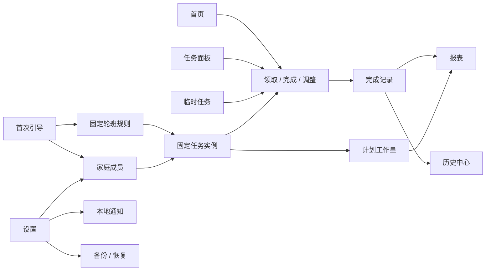
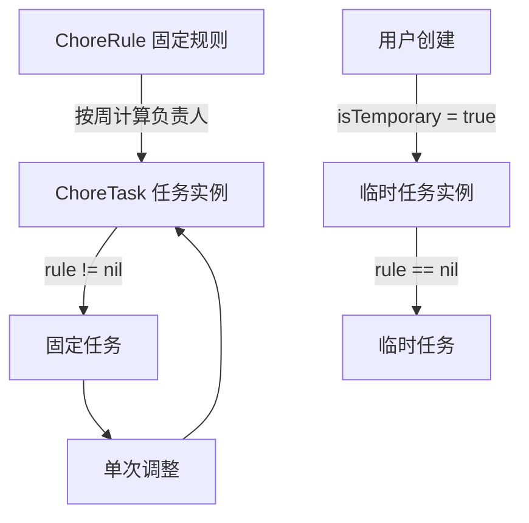
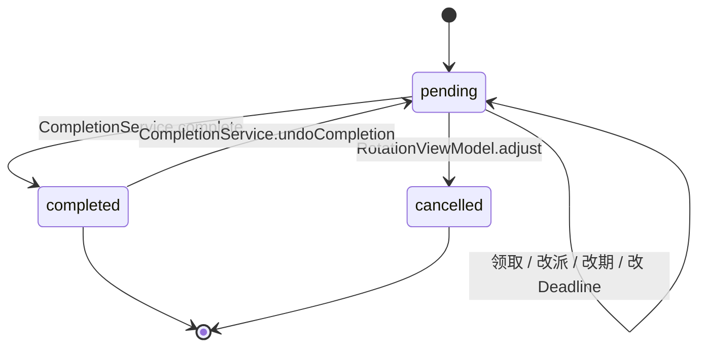
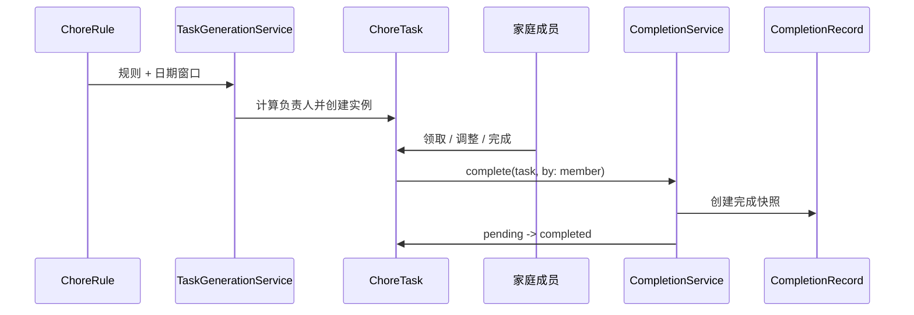

# FamilyDuty 功能架构

> 本文描述 FamilyDuty 各功能模块“提供什么能力、如何进入、如何操作、如何改变数据，以及由哪些代码负责”。内容以当前源码和测试为准；它不是下一阶段需求清单。总的代码分层、文件职责和计划映射见 [`docs/architecture.md`](architecture.md)。

## 1. 产品功能地图

FamilyDuty 的核心对象是“家庭成员、固定轮班规则、任务实例、完成记录”。用户先建立成员和固定规则，系统生成任务；任务可以被领取、完成或单次调整，完成结果进入报表和历史中心。

### 1.1 主导航功能边界

| 模块 | 解决的问题 | 主要数据范围 |
| --- | --- | --- |
| 首页 | 今天和近期最需要处理什么 | 未完成任务、逾期任务、近期完成记录 |
| 任务面板 | 今天全部任务最终处于什么状态 | 当天 pending/completed/cancelled 任务、当天完成记录 |
| 报表 | 家庭完成了多少、计划负担如何 | 完成记录、任务实例、成员 |
| 历史 | 过去具体完成了什么 | 去重后的完成记录及历史姓名快照 |
| 轮班 | 固定任务如何重复、下一次谁负责 | 轮班规则、成员顺序、固定任务实例 |
| 设置 | 家庭成员、提醒和本机数据如何管理 | 成员、通知设置、本地 JSON 备份 |

## 2. 全局概念与状态

### 2.1 任务来源

- 固定规则只负责描述重复方式和默认得分；实际日期、负责人、状态、Deadline 和调整说明保存在任务实例。
- 临时任务不关联规则，不消耗或改变固定轮班顺序。
- 从历史重新创建的任务也是新的临时任务，不复用旧任务 ID。

### 2.2 任务状态机

状态含义：

- `pending`：可以领取、完成、调整；如果有效 Deadline 已经过期，则属于逾期。
- `completed`：有对应完成记录；可以在任务面板撤销完成，回到 `pending`。
- `cancelled`：只取消本次任务；不改变规则，也不影响后续轮换。

## 3. 模块功能架构

每个模块按“目标 → 入口 → 功能分解 → 数据与依赖 → 规则和异常 → 验收边界”描述。

## 3.1 应用启动与首次引导

### 目标

让新家庭从空数据库进入可用状态，并确保每次启动或回到前台后，固定任务窗口保持完整。

### 入口与页面

| 项目 | 当前实现 |
| --- | --- |
| 应用入口 | `FamilyDutyApp` |
| 根分流 | `AppRootView` 根据 `members.isEmpty` 分流 |
| 首次引导 | `OnboardingView` / `OnboardingViewModel` |
| 主界面 | `MainTabView`，包含首页、任务面板、报表、历史、轮班、设置六个 Tab |

### 功能分解

1. 创建本地 SwiftData 容器。
2. 空数据库显示成员录入区域，允许添加、删除和设置成员颜色。
3. 输入第一项固定值日名称。
4. 点击“开始使用”时原子创建成员和第一条固定规则。
5. 首条规则保存成功后生成初始固定任务并进入主界面。
6. 应用启动或回到前台时由 `TaskGenerationCoordinator` 补齐未来任务。

### 数据与服务依赖

- `ModelContainerFactory`：正式容器或 UI 测试内存容器。
- `OnboardingViewModel`：校验成员姓名并协调首次创建。
- `RotationViewModel.saveRule`：创建首条固定规则。
- `TaskGenerationCoordinator`：启动和前台恢复时补齐任务。

### 规则和异常

- 至少需要一名非空姓名的成员。
- 首次创建流程失败时，已插入的成员必须回滚，不能留下只有成员没有规则的半成品状态。
- 任务生成失败时根层显示错误，但不清空已有任务，也不阻断用户查看数据。
- UI 测试使用 `-uiTesting` 和 seed 参数，不读取正式本地数据库。

### 验收边界

- 空数据库显示引导；创建完成后再次启动直接进入主界面。
- 创建成员和首条轮班后能看到生成的任务。
- 重复启动不会重复生成同一规则同一日期的任务。
- 回到前台后未来固定任务仍然在生成窗口内。

## 3.2 首页 Dashboard

### 目标

把“今天需要做什么”集中到一个可快速扫读、可快速操作的页面。

### 页面组成

| 区域 | 内容 | 数据来源 |
| --- | --- | --- |
| 今日进度卡 | 当前日期、今日任务总数、已完成数、进度环、新增临时任务 | 当天任务实例 |
| 已逾期 | 所有已过有效 Deadline 的 pending 任务 | `TaskDeadlineService` |
| 今天 | 今天的固定 pending 任务 | `DashboardViewModel.todayTasks` |
| 本周稍后 | 本周剩余日期的固定 pending 任务 | `DashboardViewModel.laterThisWeekTasks` |
| 临时任务 | 未逾期的临时 pending 任务 | `DashboardViewModel.temporaryTasks` |
| 近期完成 | 最近最多 8 条完成记录 | `CompletionRecord` 查询 |

### 用户操作

| 操作 | 触发条件 | 结果 |
| --- | --- | --- |
| 点击任务卡 | 已指派 | 打开 `CompletionSheet`，选择实际完成人 |
| 点击任务卡 | 待领取 | 打开 `ClaimTaskSheet` |
| 快速完成 | 任务已有负责人 | 弹出二次确认，默认使用当前负责人完成 |
| 左滑调整 | pending 任务 | 打开 `TaskAdjustmentSheet` |
| 新增临时任务 | 工具栏或进度卡按钮 | 打开 `TemporaryTaskEditorView` |
| 查看近期完成 | 近期记录项 | 只读展示；需要筛选或查看详情时进入“历史”Tab |

### 关键规则

- 已逾期任务只出现在“已逾期”，不在“临时任务”中重复出现。
- 逾期只针对 pending 任务；已完成和已取消任务不再显示逾期。
- 未设置 Deadline 的任务以计划日当天为有效截止日。
- 任务卡上的展示图标来自 `TaskPresetCatalog`，不改变保存的纯文本标题。
- 无负责人任务的无障碍文案包含“待领取”；逾期任务包含“已逾期”。

### 异常处理

- 快速完成保存失败时，任务恢复 pending，显示错误提示。
- 任务生成失败时由根层提示，不影响 Dashboard 查询已有任务。
- 没有任务或没有历史时显示明确空状态，不能显示空白区域。

### 代码与测试边界

- 页面：`FamilyDuty/Features/Dashboard/DashboardView.swift`。
- 计算：`DashboardViewModel`、`TaskDeadlineService`。
- 操作：`CompletionService`、`TemporaryTaskViewModel`、`RotationViewModel`。
- 关键 UI 标识：`dashboard-progress-card`、`dashboard-add-temporary`、`dashboard-task-*`、`dashboard-quick-complete-*`、`history-*`。
- 测试：`DashboardViewModelTests`、`DashboardFlowUITests`、`AccessibilityTests`。

## 3.3 任务面板

### 目标

提供当天任务的完整状态视图，让家庭看到待处理、已完成和已取消任务，而不是只看到待办。

### 页面组成

1. “今日工作量”摘要：按当天完成记录计算成员完成数量和得分。
2. 待处理 Section：可以领取、完成和调整。
3. 已完成 Section：展示完成者和完成时间，可以撤销完成。
4. 已取消 Section：展示取消状态和调整说明，只读。
5. 前往报表入口：从当天摘要进入报表查看更长周期。

### 用户操作

| 状态 | 点击 | 快速操作 | 结果 |
| --- | --- | --- | --- |
| pending、已指派 | 完成确认 | 快速完成、调整 | 生成完成记录或修改任务实例 |
| pending、待领取 | 领取 | 调整 | 写入负责人或修改任务实例 |
| completed | 查看完成信息 | 撤销完成 | 删除最新完成记录并恢复 pending |
| cancelled | 查看取消原因 | 无 | 保持历史状态 |

### 查询与排序

- 只筛选 `scheduledDate` 与当前日期相同的任务。
- pending 任务优先按有效 Deadline、计划日期和标题排序。
- completed 任务优先按最新完成时间倒序。
- cancelled 任务按计划日期和标题排序。
- 同一任务的完成信息取最新 `CompletionRecord`；缺少记录时显示降级文案。

### 代码与测试边界

- 页面：`TaskBoardView`。
- 分组：`TaskBoardViewModel.sections`。
- 完成/撤销：`CompletionService`。
- 当天统计：`TaskBoardViewModel.todayWorkloadSummaries` → `ScoreReportViewModel`。
- 关键 UI 标识：`task-board`、`task-board-summary`、`task-board-task-*`、`task-board-undo-*`、`task-board-overdue-*`。
- 测试：`TaskBoardViewModelTests`、`CompletionServiceTests`、`TaskBoardFlowUITests`。

## 3.4 固定轮班管理

### 目标

让家庭定义可重复的值日规则，并能预览下一位负责人，同时保留对单次任务的独立调整能力。

### 规则编辑功能

| 字段/操作 | 说明 |
| --- | --- |
| 任务名称 | 固定规则的标题，不能为空 |
| 星期 | 每周发生的 weekday |
| 轮换起始周 | 计算周次偏移的基准 |
| 参与成员 | 至少选择一名成员 |
| 成员顺序 | 通过 `MemberOrderEditorView` 拖动排序 |
| 启用规则 | 停用后不再生成新任务 |
| 默认得分 | 生成任务时复制到任务实例 |

### 负责人计算

`RotationScheduler.assignee(for:weekOf:calendar:)` 的计算过程：

1. 使用规则 `startOfRotationWeek` 和目标任务日期所在周的周起点。
2. 计算两个周起点之间的完整周数。
3. 对 `participantOrder.count` 取模。
4. 从规则参与成员中按 UUID 顺序取出负责人。

成员关系数组的自然顺序不参与轮班计算。

### 保存规则的行为

- 新建规则后生成未来任务。
- 编辑规则时，删除未来、pending、没有调整说明的旧任务，再按新规则生成。
- 已完成任务和带调整说明的任务不被规则编辑覆盖。
- 停用规则后不生成新任务，但已存在任务保留。

### 单次任务调整

固定任务在 `TaskAdjustmentSheet` 中可以单独修改：

- 负责人。
- 计划日期。
- Deadline。
- 得分。
- 只取消本次任务及取消原因。

这些修改只写入 `ChoreTask`，不改变 `ChoreRule` 的成员顺序和后续周次。

### 代码与测试边界

- 页面：`RotationListView`、`RuleEditorView`、`MemberOrderEditorView`、`TaskAdjustmentSheet`。
- 逻辑：`RotationViewModel`、`RotationScheduler`、`TaskGenerationService`。
- 关键 UI 标识：`rotation-add-rule`、成员顺序编辑相关标识、调整表单字段标识。
- 测试：`RotationSchedulerTests`、`TaskGenerationServiceTests`、`RotationViewModelTests`。

## 3.5 临时任务与任务操作

### 目标

支持家庭临时插入一次性任务，不污染固定轮班；同时提供领取、完成、撤销完成和单次调整等共享操作。

### 临时任务创建

`TemporaryTaskEditorView` 的输入流程：

1. 选择常用任务预设，或手动输入任务名称。
2. 选择计划日期。
3. 可选设置 Deadline；关闭开关时保存 `nil`。
4. 输入得分。
5. 选择家庭成员，或保留“待领取”。
6. 保存为 `isTemporary == true`、`rule == nil` 的 `ChoreTask`。

预设只回填标题。用户手动修改标题后，预设选择状态清空；不会覆盖日期、Deadline、得分或负责人。

### 待领取任务

- 创建时 `assignee == nil`。
- Dashboard 和任务面板显示“待领取”。
- 选择成员后由 `TemporaryTaskViewModel.claim` 原子写入负责人。
- 已完成、已取消或已指派任务不能再次领取。

### 完成任务

`CompletionSheet` 允许选择实际完成者，完成服务会：

1. 校验任务仍为 pending。
2. 创建 `CompletionRecord`，保存实际完成人、完成时间、计划工作日、得分和姓名快照。
3. 将任务改为 completed。
4. 一次保存；失败则恢复 pending 并删除未保存记录。

“实际完成者”可以和任务负责人不同，这是分配人与实际执行人的区分。

### 撤销完成

任务面板的已完成任务可撤销：

- 只允许已完成任务操作。
- 找到该任务最新完成记录并删除。
- 任务恢复 pending。
- 保存失败时回滚状态和删除操作。

### 共享代码与测试

- `TemporaryTaskViewModel`：创建和领取。
- `CompletionService`：完成和撤销。
- `CompletionSheet`、`ClaimTaskSheet`、`QuickCompletionConfirmation`：共享交互。
- `TaskAdjustmentSheet` + `RotationViewModel.adjust`：实例级调整。
- 测试：`TemporaryTaskViewModelTests`、`CompletionServiceTests`、Dashboard/TaskBoard UI 流程测试。

## 3.6 报表与计划工作量

### 目标

在不改变任务本身的情况下，分别回答“实际完成了多少”和“计划分配了多少”。

### 报表周期

| 周期 | 显示内容 |
| --- | --- |
| 日报 | 当天成员完成数量、完成得分、当天工作量摘要；不显示趋势图 |
| 周报 | 本周成员完成数量、得分和按工作日的每日趋势 |
| 月报 | 本月成员完成数量、得分和按工作日的每日趋势 |

用户可以通过上/下周期按钮或日期选择器浏览历史日期。`ReportsViewModel` 只负责周期状态，统计由 `ScoreReportViewModel` 计算。

### 实际完成量

1. 从 `CompletionRecord` 读取完成数据。
2. 通过 `workDate` 进入日/周/月区间，而不是用精确完成时间划分工作日。
3. 使用 `latestRecords` 按任务去重。
4. 按完成者 ID 聚合；成员删除后使用 `completedByName` 作为历史显示名称。
5. 输出完成数量和总得分。

### 计划工作量

`PlannedWorkloadViewModel` 从任务实例计算本周每位成员：

- 已分配任务数。
- 计划得分。

当前实现只统计有有效负责人且计划日期落在当前自然周内的任务；待领取任务不计入任何成员。计划工作量不是 SwiftData 字段，也不等同于完成量。

### 空状态与测试

- 周/月没有完成记录时趋势区域显示空状态。
- 报表图表同时提供 accessibility label 和 value，不依赖颜色识别成员。
- 测试：`ReportsViewModelTests`、`ScoreReportViewModelTests`、`PlannedWorkloadViewModelTests`、`ReportsFlowUITests`。

## 3.7 历史中心

### 目标

让家庭按时间、完成人和任务名称回看完成记录，并从历史记录快速创建相似临时任务。

### 筛选维度

| 筛选 | 选项 |
| --- | --- |
| 日期 | 全部日期、今天、最近 7 天、本月、自定义起止日期 |
| 成员 | 当前成员、已删除成员的历史姓名、全部成员 |
| 任务名称 | 搜索标题，忽略首尾空白并进行不区分大小写匹配 |

自定义日期会先归一化起止日期，并包含结束日的完整一天。

### 列表与详情

- 列表按完成时间倒序显示去重后的最新记录。
- 列表项展示任务名称、完成者、精确完成时间和得分。
- 详情展示任务信息、计划工作日、完成者、完成时间和得分。
- 如果成员已删除，优先显示 `completedByName` 快照。
- 如果任务关系缺失，使用降级任务名称，不能导致历史页面崩溃。

### 重新创建类似任务

历史详情可生成 `TemporaryTaskDraft`：

- 复制任务标题和任务得分。
- 不复制旧日期、负责人、Deadline、状态、完成记录或固定规则。
- 打开临时任务编辑页继续补充新的日期和负责人。

### 代码与测试边界

- 页面：`HistoryView`、`HistoryDetailView`。
- 逻辑：`HistoryViewModel`、`TemporaryTaskDraft`、`ScoreReportViewModel.latestRecords`。
- 关键 UI 标识：`history-view`、`history-search-field`、`history-filters`、`history-record-*`、`history-detail`、`history-recreate`。
- 测试：`HistoryViewModelTests`、`HistoryFlowUITests`。

## 3.8 家庭成员与设置

### 家庭成员管理

`SettingsView` 提供成员列表、新增、编辑、颜色识别、排序显示和删除入口。

成员删除由 `MemberDeletionService` 保护，以下任一条件成立时阻止删除并列出具体原因：

- 成员仍参与固定轮班规则。
- 成员仍负责 pending 任务。
- 完成记录仍关联该成员。

当前策略优先保证数据可追溯；删除历史成员前需要先处理所有阻止项。

### 通知设置

设置页保存三类本地状态：

- 是否启用本地提醒。
- 每日汇总时间。
- 逾期提醒时间。

开启总开关时，如果权限未决定，先请求系统授权；权限被拒绝时自动关闭应用内开关并提示进入系统设置。

### 数据管理

设置页进入 `DataManagementView` 后可以：

- 通过系统文件导出 JSON 备份。
- 从系统文件选择 JSON 备份。
- 在替换当前数据前显示破坏性确认。
- 恢复成功后显示状态；失败时显示错误。

### 代码与测试边界

- 页面：`SettingsView`、`MemberEditorView`、`NotificationSettingsView`、`DataManagementView`。
- 逻辑：`MemberDeletionService`、`NotificationAuthorizationService`、`NotificationScheduler`、`LocalBackupService`。
- 关键 UI 标识：`settings-add-member`、`data-export-backup`、`data-import-backup`。
- 测试：`MemberDeletionServiceTests`、`NotificationSchedulerTests`、`LocalBackupServiceTests`、`AccessibilityUITests`。

## 3.9 本地通知

### 目标

在本机提供每日待办汇总和逾期提醒，不让通知权限影响核心任务功能。

### 调度内容

| 托管 identifier | 内容 | 条件 |
| --- | --- | --- |
| `family-duty.daily-summary` | 当天 pending 任务标题汇总 | 开启提醒且当天有 pending 任务 |
| `family-duty.overdue-summary` | 逾期 pending 任务标题汇总 | 开启提醒且存在逾期任务 |

### 刷新机制

任务状态、计划日期、Deadline、负责人或通知设置发生变化时，根层 modifier 重新计算签名并刷新：

1. 读取待处理通知。
2. 只移除 FamilyDuty 自己的两个托管请求。
3. 重新计算当天汇总和逾期汇总。
4. 无任务时不创建对应请求。

这样可以避免完成任务后仍收到旧提醒，也不会删除其他应用或系统创建的通知。

### 异常边界

- 权限拒绝：任务仍可创建、完成、调整和查看。
- 请求通知失败：设置页显示错误，已有本地数据不回滚。
- 跨天后刷新：使用当前日期和 `TaskDeadlineService`，不复用前一天的任务集合。

## 3.10 本地备份与恢复

### 目标

在单设备离线边界内提供用户可控制的数据导出与恢复，不引入云同步。

### 备份内容

`LocalBackupService.BackupPayload` 包含：

- 成员：ID、姓名、颜色、排序。
- 规则：ID、标题、星期、起始轮班周、启用状态、默认得分、成员 ID 顺序。
- 任务：ID、标题、计划日期、Deadline、得分、临时标记、状态、调整说明、负责人 ID、规则 ID。
- 完成记录：ID、完成时间、工作日、得分、完成者姓名快照、任务 ID、完成者 ID。

### 导出流程

1. 查询全部模型。
2. 按稳定顺序排序，生成当前 schema version 的 DTO。
3. JSON 编码为 `Data`。
4. 通过 `FamilyDutyBackupDocument` 交给系统文件导出器。

### 恢复流程

1. 选择 JSON 文件并读取数据。
2. 用户确认“替换当前数据”。
3. 解码并校验 schema version、重复 ID、空成员姓名和关系引用。
4. 删除当前记录、任务、规则和成员。
5. 按成员 → 规则 → 任务 → 完成记录顺序重建关系。
6. 一次保存；失败时回滚。

### 风险控制

- 恢复是替换当前数据的破坏性操作，必须经过确认。
- 不支持的 schema version 不应尝试恢复。
- 备份关系缺失或非法值时拒绝整个文件，不执行部分恢复。
- 备份仍是本地文件，用户需要自行选择安全存储位置。

## 3.11 DesignSystem 与无障碍功能

### 目标

确保所有功能模块在 iPad 横竖屏、动态字体、深色模式和辅助功能场景下保持一致且可操作。

### 共享能力

| 能力 | 组件/来源 |
| --- | --- |
| 语义颜色、背景、间距、圆角 | `FamilyDutyTheme` |
| 图标徽章、分组标题、状态胶囊 | `FamilyDutyIconBadge`、`FamilyDutySectionHeader`、`FamilyDutyStatusPill` |
| 进度展示 | `FamilyDutyProgressRing` |
| 成员识别 | `FamilyDutyMemberChip`、`FamilyDutyMemberColor` |
| 空状态 | `FamilyDutyEmptyState` |
| 任务卡 | `FamilyDutyTaskCard`、`TaskTitleView` |

### 约束

- 任务 emoji/SF Symbol 仅作视觉辅助，VoiceOver 不重复朗读装饰 emoji。
- pending、completed、cancelled、overdue 必须同时使用文字或 SF Symbol 表达，不能只依赖颜色。
- 主要按钮和任务行保持至少 44pt 高度。
- 任务标题、完成者、截止日期和错误信息在最大字体下仍可读。
- 既有 UI 测试 identifier 和关键中文文案是兼容性接口，重构视觉层不能删除。

## 4. 跨模块业务流程

### 4.1 固定任务从规则到完成记录

### 4.2 单次调整不影响未来轮班

1. 用户从首页或任务面板打开任务调整。
2. ViewModel 先验证得分、Deadline 和取消输入。
3. 只更新当前任务实例。
4. 规则的 `participantOrder`、起始周和后续日期不变。
5. 下一周任务仍由原规则和原成员顺序计算。

### 4.3 完成结果的下游消费者

一次完成操作会影响多个展示模块，但只通过同一份完成记录传递：

| 下游 | 使用内容 |
| --- | --- |
| Dashboard | 近期完成最多 8 条 |
| TaskBoard | 当天已完成分组、完成者和完成时间 |
| Reports | 周期内完成数量、得分和趋势 |
| History | 全量历史筛选、详情和重新创建 |
| Notifications | pending/overdue 汇总刷新 |

## 5. 功能验收矩阵

| 模块 | 最小验收路径 | 主要测试 |
| --- | --- | --- |
| 启动/引导 | 空数据库 → 创建成员 → 创建首个规则 → 进入首页 | `OnboardingViewModelTests`、`OnboardingUITests` |
| 首页 | 查看逾期/今天/本周/临时 → 完成一项 → 近期记录出现 | `DashboardViewModelTests`、`DashboardFlowUITests` |
| 任务面板 | 当天 pending/completed/cancelled 同时可见 → 完成 → 撤销 → 再完成 | `TaskBoardViewModelTests`、`CompletionServiceTests`、`TaskBoardFlowUITests` |
| 轮班 | 创建两人规则 → 检查多周负责人 → 调整一周 → 检查后续顺序 | `RotationSchedulerTests`、`TaskGenerationServiceTests`、`RotationViewModelTests` |
| 临时任务 | 预设回填 → 指定/待领取 → 领取 → 完成 | `TemporaryTaskViewModelTests`、`TaskPresetCatalogTests`、`TemporaryTaskPresetFlowUITests` |
| Deadline | 设置 Deadline → 跨日变为逾期 → 完成/取消后移除逾期 | `TaskDeadlineServiceTests`、`DashboardFlowUITests` |
| 报表 | 切换日/周/月 → 浏览历史周期 → 查看实际与计划工作量 | `ReportsViewModelTests`、`ScoreReportViewModelTests`、`PlannedWorkloadViewModelTests`、`ReportsFlowUITests` |
| 历史 | 日期/成员/名称筛选 → 查看详情 → 重新创建类似任务 | `HistoryViewModelTests`、`HistoryFlowUITests` |
| 设置 | 新增/编辑成员 → 尝试删除受引用成员 → 配置通知/备份 | `MemberDeletionServiceTests`、`NotificationSchedulerTests`、`LocalBackupServiceTests` |
| 可访问性 | 最大字号、横竖屏、空状态、关键 identifier 和标签 | `AccessibilityTests`、`AccessibilityUITests`、`FamilyDutyVisualFlowUITests` |

## 6. 模块变更规则

新增或修改功能时，先判断它影响哪一类对象：

1. 影响任务生命周期或统计口径：先更新领域规则、Service 和 ViewModel 测试。
2. 影响持久化字段或关系：同步更新备份 DTO、恢复校验和持久化测试。
3. 影响多个页面的交互：提取共享 Sheet、Service 或 ViewModel，不在页面间复制实现。
4. 只影响展示：优先修改 DesignSystem 或展示组件，不改变模型字段和查询语义。
5. 影响用户流程：补充稳定 accessibility identifier 和对应 UI 测试。
6. 任何规则级与实例级行为都要明确写出作用范围，防止一次调整意外改变未来轮班。
